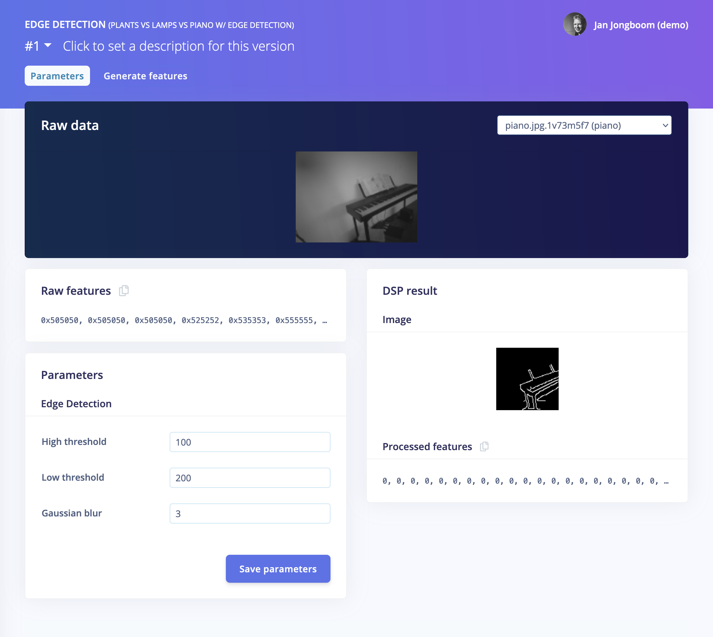

# Edge Detection preprocessing block

This implements an edge detection [processing block](https://docs.edgeimpulse.com/docs/custom-blocks) in Edge Impulse. How to use:

1. Docker:
    1. Build the container:

        ```
        $ docker build -t edge-detection-block .
        ```

    1. Run the block:

        ```
        $ docker run -p 4446:4446 -it --rm  edge-detection-block
        ```

1. Or, locally:
    1. Install Python 3.8.
    1. Install the dependencies:

        ```
        $ pip3 install -r requirements-blocks.txt
        ```

    1. Run the block:

        ```
        $ python3 dsp-server.py
        ```

1. Install [ngrok](https://ngrok.com) and open up port 4446 to the world:

    ```
    $ ngrok http 4446
    ```

    Note down the 'Forwarding' address that starts with https, e.g.:

    ```
    Forwarding                    https://4e9e1e61e3aa.ngrok.io -> http://localhost:4446
    ```

1. In Edge Impulse, go to **Create impulse**, click *Add a processing block*, click *Add custom block* and enter the URL from the previous step.
1. You now have edge detection as a preprocessing block:

    

1. Train your model as usual 🚀
